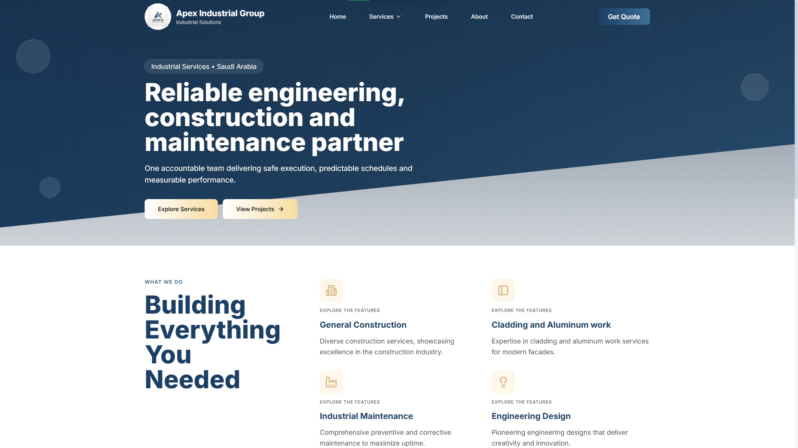
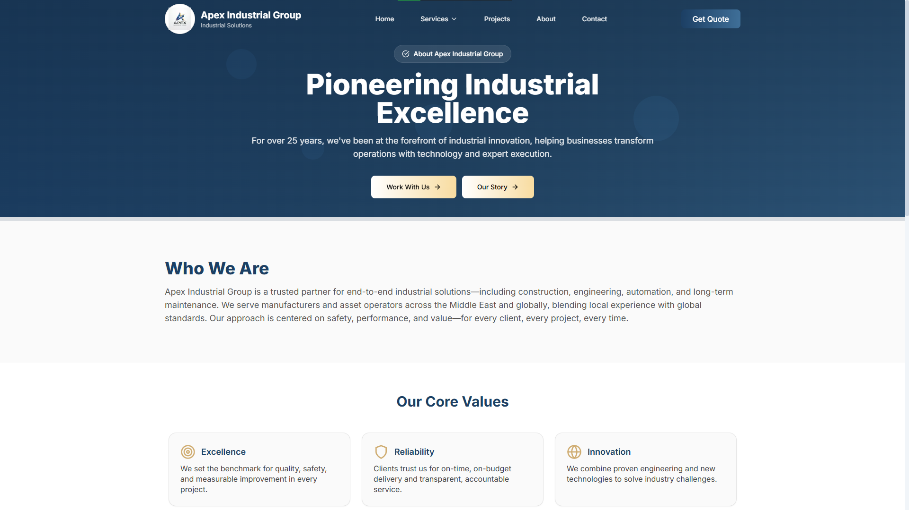
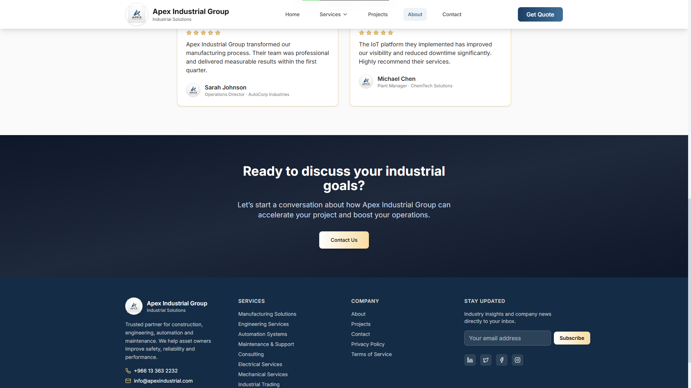
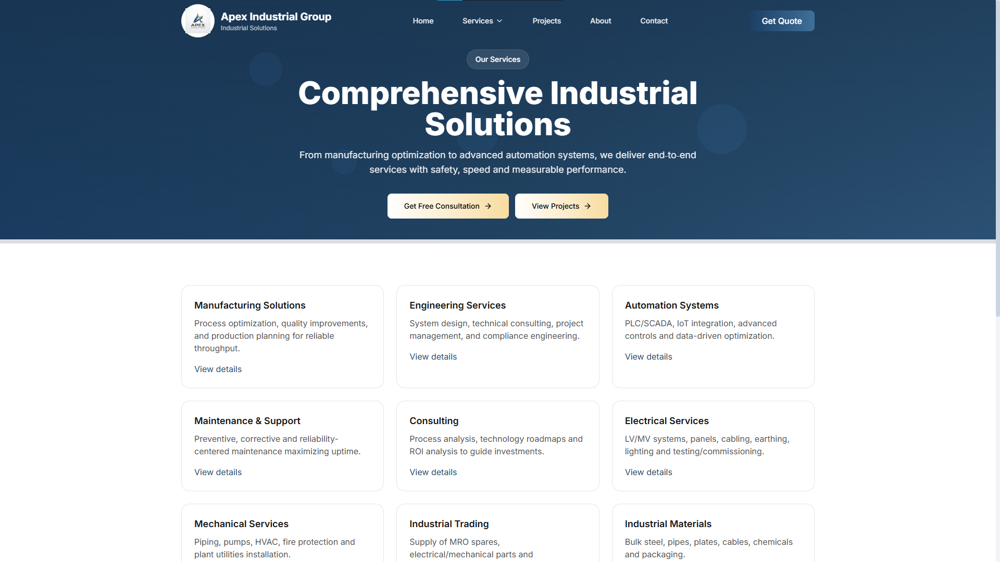
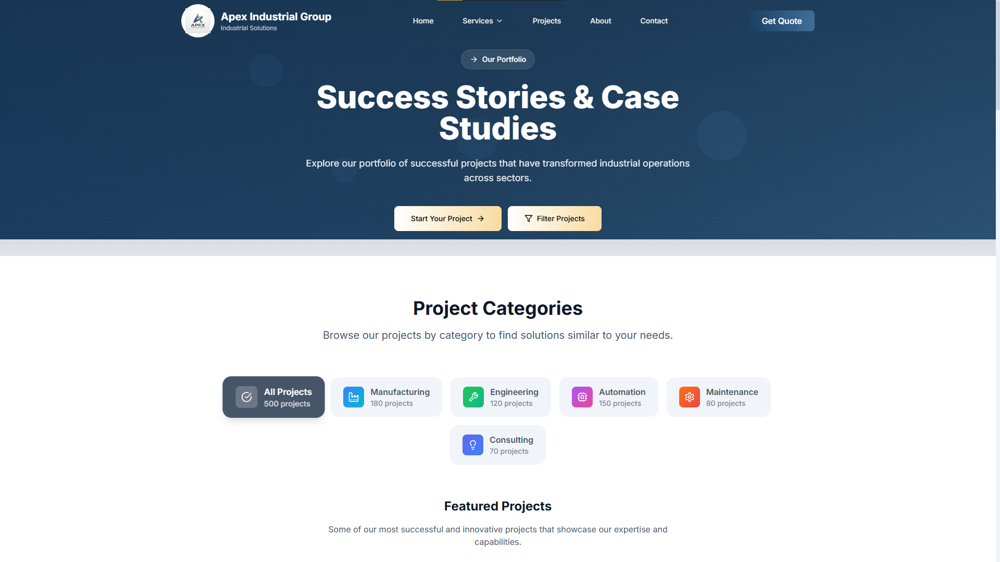
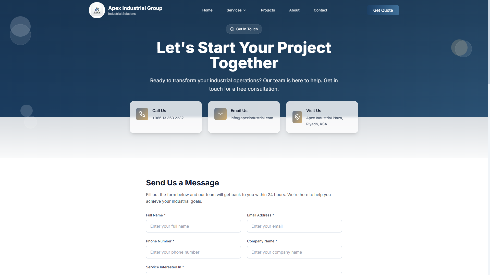

# 🏭 Apex Industrial Group — Enterprise Industrial Services Platform

[](https://nextjs.org/)
[](https://www.typescriptlang.org/)
[](https://tailwindcss.com/)
[](https://github.com/)
[](LICENSE)

A production-grade, high-performance web platform for modern industrial service providers, EPC contractors, and plant engineering asset operators. Designed for enterprise credibility, multi-device responsiveness, robust security, and seamless search engine indexability.

---

## 📸 Screenshots & Visual Walkthrough

### 1. Homepage & Hero Section


### 2. Corporate Overview & Company History



### 3. Industrial Services Matrix


### 4. Key Projects & Deliverables


### 5. Secure Contact & RFQ Engine


---

## ✨ Key Features & Capabilities

- 🎨 **Enterprise B2B Aesthetics**: Custom industrial design system built with deep cobalt blue (`#0f172a`), slate accents, warm gold CTA highlights, glassmorphism, and micro-interactions.
- ⚡ **Dynamic App Router Architecture**: Server and client components engineered using Next.js 14 App Router for fast initial load times and optimized client bundles.
- 🛠️ **Data-Driven Services Engine**: Dynamic service routing (`/services/[id]`) backed by centralized type-safe service schemas ([data/services.ts](./data/services.ts)).
- 🔒 **Comprehensive Security Hardening**:
  - **HTTP Security Headers**: `Strict-Transport-Security`, `X-Frame-Options`, `X-Content-Type-Options`, `Referrer-Policy`, and `Permissions-Policy` configured in `next.config.js`.
  - **Information Disclosure Mitigation**: Server header (`x-powered-by`) disabled.
  - **API Rate Limiting & Input Sanitization**: Contact API (`/api/contact`) enforces per-IP sliding window rate limiting, honeypot spam protection, HTML tag stripping, and Zod runtime schema validation.
  - **Environment Hygiene**: Strict `.gitignore` rules isolating secrets and `.env.example` template provided.
- 🚀 **Production Error Boundaries**: Dedicated fallback UI for 404 Not Found (`app/not-found.tsx`), Page Errors (`app/error.tsx`), and Global Layout Failures (`app/global-error.tsx`).
- 🔍 **SEO & Search Engine Indexing**:
  - Automatic `sitemap.xml` generation via [app/sitemap.ts](./app/sitemap.ts).
  - Robots policy via [app/robots.ts](./app/robots.ts).
  - OpenGraph cards (`og-image.jpg`), Twitter summaries, and rich structured metadata in [app/layout.tsx](./app/layout.tsx).
- ⚖️ **Legal & Compliance Ready**: Includes dedicated Privacy Policy ([app/privacy/page.tsx](./app/privacy/page.tsx)) and Terms of Service ([app/terms/page.tsx](./app/terms/page.tsx)).

---

## 🛠️ Technology Stack

- **Core Framework**: [Next.js 14 (App Router)](https://nextjs.org/)
- **Language**: [TypeScript 5.3](https://www.typescriptlang.org/)
- **Styling**: [Tailwind CSS 3.3](https://tailwindcss.com/) & [PostCSS](https://postcss.org/)
- **Animations**: [Framer Motion 10](https://www.framer.com/motion/)
- **Iconography**: [Lucide React](https://lucide.dev/)
- **Forms & Validation**: [React Hook Form](https://react-hook-form.com/) & [Zod](https://zod.dev/)
- **Email Delivery**: [Nodemailer 9](https://nodemailer.com/)

---

## 📁 Repository Structure

```
.
├── app/
│   ├── about/            # Corporate overview and milestone history
│   ├── api/
│   │   └── contact/      # Rate-limited & sanitized email endpoint
│   ├── contact/          # Interactive RFQ and contact form
│   ├── privacy/          # Privacy Policy compliance page
│   ├── projects/         # Industrial projects portfolio
│   ├── services/         # Dynamic service catalog ([id])
│   ├── terms/            # Terms of Service compliance page
│   ├── error.tsx         # Section error boundary
│   ├── global-error.tsx  # Root error boundary
│   ├── layout.tsx        # Base layout with global navigation & metadata
│   ├── not-found.tsx     # Custom 404 page
│   ├── page.tsx          # Homepage
│   ├── robots.ts         # SEO Robots rules
│   └── sitemap.ts        # Dynamic XML Sitemap generator
├── components/
│   ├── navigation.tsx    # Header navbar with dynamic dropdowns
│   ├── footer.tsx        # Enterprise footer with quick links
│   ├── loading.tsx       # Skeleton loaders & spinner UI
│   └── sections/         # Reusable page section components
├── data/
│   └── services.ts       # Centralized service catalog data source
├── public/
│   └── images/
│       ├── brand/        # Apex Industrial logos, favicon, and OG banner
│       └── docs/         # Documentation screenshots for GitHub
├── .env.example          # Environment variables template
├── next.config.js        # Next.js config with HTTP security headers
├── package.json          # Dependencies and scripts
└── tsconfig.json         # TypeScript strict configuration
```

---

## 🚀 Getting Started

### Prerequisites

- **Node.js**: v18.17.0 or higher
- **Package Manager**: `npm` (v9+) or `pnpm` (v8+)

### 1. Installation

Clone the repository and install dependencies:

```bash
git clone https://github.com/your-org/apex-industrial-group.git
cd apex-industrial-group
npm install
```

### 2. Environment Configuration

Copy the sample environment file and configure your SMTP credentials:

```bash
cp .env.example .env.local
```

Edit `.env.local`:

```env
SMTP_HOST=smtp.yourprovider.com
SMTP_PORT=587
SMTP_SECURE=false
SMTP_USER=your_smtp_username
SMTP_PASS=your_smtp_password

MAIL_FROM="Apex Industrial Contact <no-reply@apexindustrial.com>"
MAIL_TO=info@apexindustrial.com
```

### 3. Run Development Server

Launch the local development server:

```bash
npm run dev
```

Open [http://localhost:3000](http://localhost:3000) in your browser to view the application.

---

## 🧪 Verification & Production Build

Run static type checking and ESLint before deploying to production:

```bash
# Check TypeScript types
npm run type-check

# Run ESLint check
npm run lint

# Build optimized production bundle
npm run build

# Start production server locally
npm run start
```

---

## 🔒 Security Reporting

Security vulnerability reports or disclosure inquiries can be sent directly to `security@apexindustrial.com` or submitted through GitHub Security Advisories.

---

## 📄 License

Distributed under the MIT License. See [LICENSE](LICENSE) for details.
